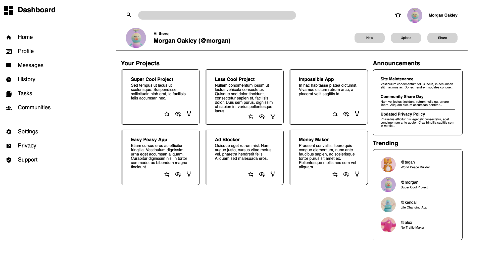
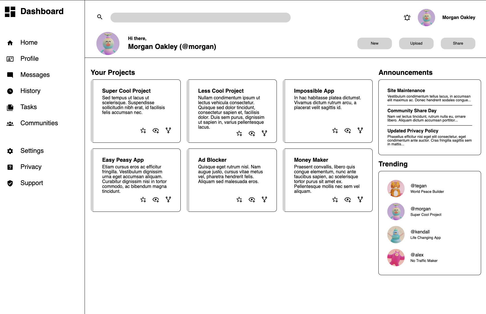
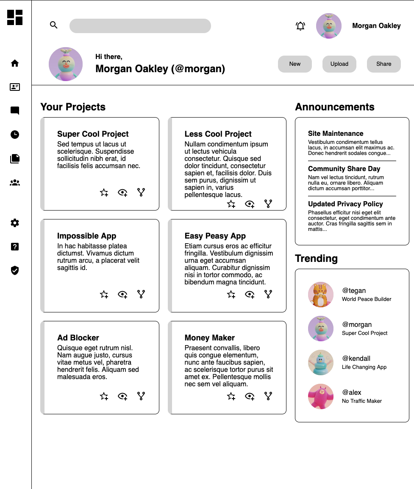
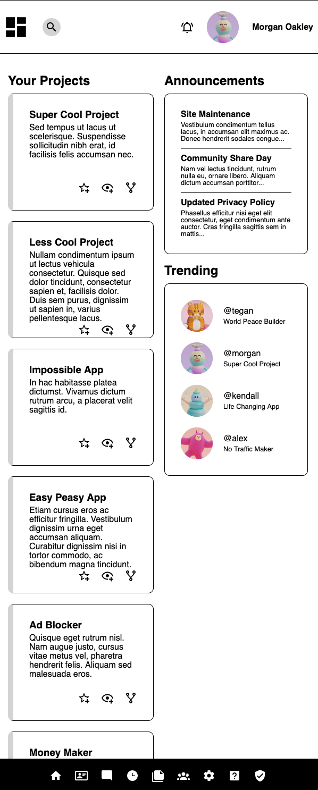

# Dashboard Project!

A live implementation of the project can be found at this [GitHub Pages Link](https://emannuelmartineztest.github.io/dashboard/).

## Designs
I wanted to create a fully adaptive dashboard, that can be used from any screen type, whether that was an ultra-wide monitor or a mobile screen.
This is mostly a 'working' mock-up, in the sense that it is responsive. But...none of the buttons do anything, so yeah. 

Still, it was fun working through all the different sizes.

### Hamburger Menus
I explicitly did not want to implement this design paradigm in this project, since it does feel a bit old-school. I feel like just have
the buttons always accessible is the better approach, and it's the approach that people have gotten used to as a result of smartphones.

I did think I could have reordered/removed some of the buttons I ultimately ended up with...

### Mobile Buttons

I could have gotten rid of the Profile, Settings, Privacy, and Support icons.

The reason being that on narrow screens, one already has the habit of clicking the profile picture to get settings information, as well as profile information.
Privacy and Support could have also been hidden within Settings as well. This means I *could* have implemented New, Upload, and Share as buttons in
my bottom bar...which I will probably do in the future.

## Layouts
### Ultra-Wide

### Wide

### Medium

### Narrow
